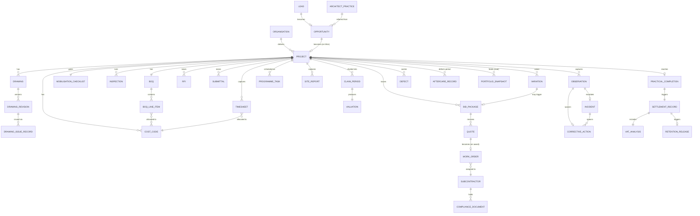

# Domain Concepts — Entities

Every domain concept JPMS talks about, grouped by the lifecycle stage where it first appears. JSON Schemas are written workflow-by-workflow as each one moves Draft → In Review.

---

## 00 — Sales, Marketing & CRM

| Entity | Notes |
|---|---|
| Lead | Captured from any channel. |
| Opportunity | Qualified lead. |
| Contact | A person inside a Company / Architect Practice / Referrer. |
| Company / Architect Practice | Organisation a contact belongs to. |
| Site Visit | Booking + notes + photos against an Opportunity. |
| Proposal | Issued document; tracks negotiation rounds. |
| Win/Loss Reason | Structured reason captured on outcome. |
| Project (shell) | Created on Won; carries lead context into 01. |

## 01 — Drawing Receipt & Document Control

| Entity | Notes |
|---|---|
| Drawing | A drawing per scope. |
| Drawing Revision | Versioned with supersede logic. |
| Drawing Issue Record | Who was issued which revision, when, with acknowledgment. |
| Submittal | Materials / samples / manufacturer details for approval before installation (also referenced from 05). |
| Correspondence | Email-in / email-out tied to project. |
| Instruction Log | Architect / client / consultant instructions. |

## 02 — Pre-Construction: Tender & BoQ

| Entity | Notes |
|---|---|
| Tender | Becomes a project's commercial basis. |
| BoQ | One per project; replaces standalone Excel. |
| BoQ Line Item | Discrete unit of priced and tracked work. |
| Rate | Held in the rate library. |
| Rate Library | Versioned; supplier-linked. |
| Cost Code | Architect's client-facing code; threads through everywhere. |
| Walk-Round Note | Pre-construction site notes / photos. |

## 03 — Subcontractor Procurement & Onboarding

| Entity | Notes |
|---|---|
| Subcontractor | Master record with trade tags. |
| Bid Package | Trade-scoped package issued to subcontractors. |
| Quote | Returned by subcontractor into JPMS. |
| Work Order | Contract artefact post-award. |
| Compliance Document | Insurance, certs, tickets — with expiry. |
| RAMS | Project-specific risk & method statement. |
| CIS Status | HMRC verification status. |
| Renewal Event | Compliance renewal cycle. |

## 04 — H&S Site Mobilisation & Compliance

| Entity | Notes |
|---|---|
| Mobilisation Checklist | Per project; populated from project + subcontractor data. |
| Inspection Template | Reusable template; versioned. |
| Inspection (instance) | A run of a template with photos, signatures, timestamps. |
| Audit | Formal audit with findings + close-out. |
| Observation | Site observation that may become an incident or corrective action. |
| Incident | Recordable event; carries investigation. |
| Near Miss | Recordable event; investigation lighter than incident. |
| Corrective Action | Owner, deadline, evidence-on-close. |
| Toolbox Talk | Topic + attendance + signatures. |
| Induction Record | Subcontractor / staff induction completion. |
| Permit | Issue, expiry, close. |
| Temporary Works | Design, approval, inspection records. |

## 05 — RFIs, Submittals, Variations & Delays

| Entity | Notes |
|---|---|
| RFI | Question to architect; reply attaches. |
| Submittal | Approval before install (Submittal entity also referenced from 01). |
| Variation | Updates BoQ; may trigger a procurement loop into 03. |
| NoD (Notice of Delay) | Formal delay notice. |

## 06 — Site Delivery, Programme & Reporting

| Entity | Notes |
|---|---|
| Programme Task | Tied to BoQ line items. |
| Site Report | Daily capture from the site app. |
| Defect (early identification) | Snag spotted during live delivery; matures into a Defect record in 08. |

## 07 — Valuations, Cashflow & Forecasting

| Entity | Notes |
|---|---|
| Valuation | Per Claim Period; feeds expected income on the cashflow forecast. |
| Claim Period | Contractual cycle for valuation reporting. |
| Programme Valuation Report | The issued artefact per Claim Period. |
| Cashflow Forecast Snapshot | A JPMS-produced forecast at a point in time. |
| Person | Internal staff submitting timesheets. |
| Timesheet | Daily entry per person × project × date. |
| Timesheet Approval | Weekly batch approval record. |
| Cost Code Budget | Per-cost-code budget (allocated / committed / spent / remaining). |
| Cost Code Allocation | Each timesheet entry's allocation against a cost code. |

## 08 — Quality, Snags, Handover & Aftercare

| Entity | Notes |
|---|---|
| Defect | Snag with assignment + deadline + evidence. |
| Punch List Item | Aggregate punch-list grouping. |
| Practical Completion | The PC event on a project; triggers 08 close-out flows. |
| Handover Pack Item | Warranty / O&M / certificate carried into the close-out pack. |
| Settlement Record | Final audit-grade commercial summary. |
| VAT Analysis | Zero-rated vs standard-rated breakdown; carries client agreement. |
| Retention Release | Trigger published downstream to accountancy. |
| Aftercare Record | Defects-period reporting and resolution. |

## 09 — Portfolio Reporting & Analytics

| Entity | Notes |
|---|---|
| Portfolio Snapshot | Retained per Claim Period for historical comparison. |
| Leading Indicator | Configurable metric (e.g. overdue RFI count, margin actual vs target). |
| Threshold | Crossed threshold triggers an Exception Alert. |
| Exception Alert | Routed to FD or Director by severity. |

---

## Cross-cutting

| Entity | Notes |
|---|---|
| Organisation | The JBB / Jewel entity (BB, PS, PFP). Cross-entity flag on most other records. |
| Project | Central organising concept. Belongs to an Organisation. |

---

## Entity-relationship diagram (overview)

