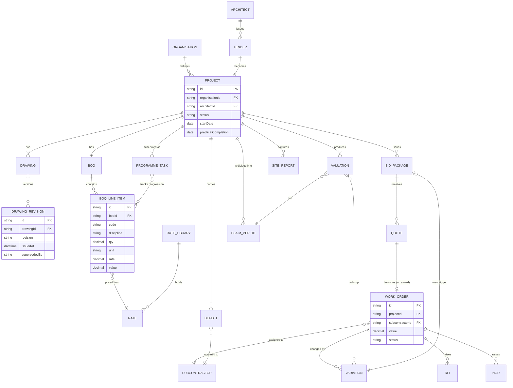
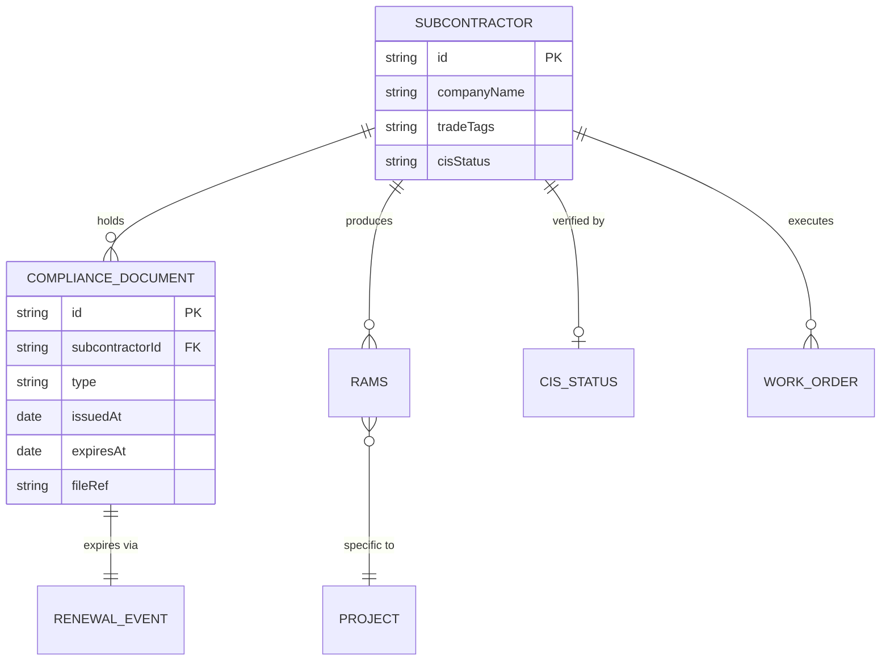
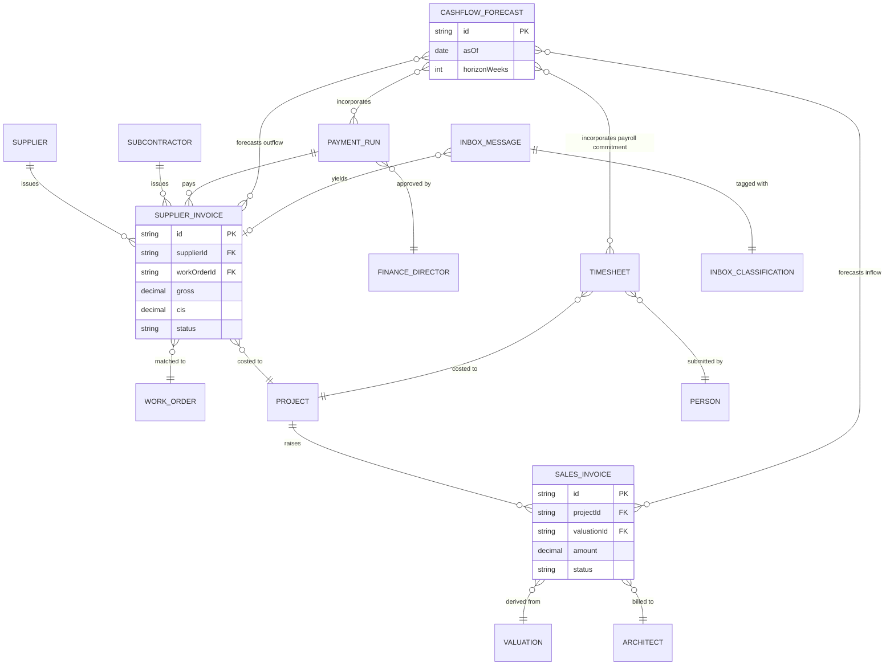
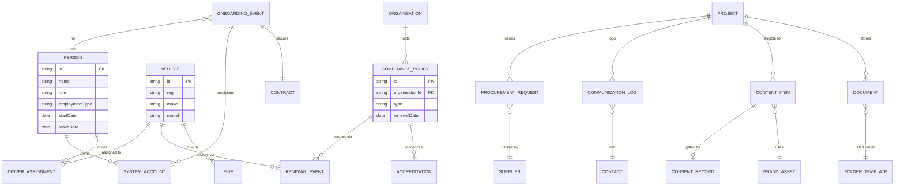
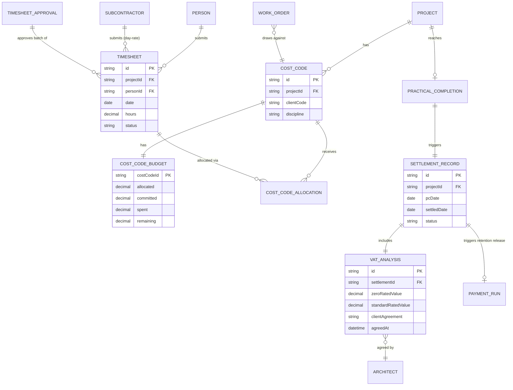

# Entity Relationship Diagram

First-cut ERD for the JPMS platform, derived from the entities surfaced by the twenty-one workflows in the JBB audit. Schemas are not yet written — this diagram exists so the workflows and journeys can reference entities by name and so the eventual schemas have a shape to grow into.

**Sourced from:** [`/docs/meetings/2026-05-20-jbb-workflow-audit.md`](../meetings/2026-05-20-jbb-workflow-audit.md), [`/docs/meetings/2026-05-20-coverage-audit-and-additions.md`](../meetings/2026-05-20-coverage-audit-and-additions.md), and [`/docs/meetings/2026-05-18-domain-discovery.md`](../meetings/2026-05-18-domain-discovery.md).

**Status:** Draft — refined as each workflow moves Draft → In Review and each schema gets written.

---

## Diagram

The ERD is split into five sub-diagrams so each renders cleanly. They share entities (especially `Project`, `Subcontractor`, `Person`, `Cost Code`) — the splits are for legibility, not data isolation.

### 1 · Project lifecycle (workflows 01–07)

### 2 · Subcontractor & compliance (workflow 08)

### 3 · Finance (workflows 09–13)

### 4 · People, ops & support (workflows 14–21)

### 5 · Timesheets & project settlement (workflows 22, 23)

---

## Entity index

Sourced workflows shown in brackets. Schemas remain `to be created`.

### Project lifecycle

| Entity | First surfaced in | Notes |
|---|---|---|
| `Organisation` | All | The JBB / Jewel entity (BB, PS, PFP). Multi-entity flag on most other records. |
| `Project` | All | Central organising concept. |
| `Architect` | 2026-05-18 | External; issues tenders. |
| `Tender` | 2026-05-18 | Becomes a project on award. |
| `Cost Code` | 2026-05-18 | Architect's reference; threads through the project. |
| `Drawing` | 01, 02 | A drawing per scope. |
| `Drawing Revision` | 01 | Versioned with supersede logic. |
| `BoQ` | 02 | One per project (replaces standalone Excel). |
| `BoQ Line Item` | 02, 04, 05 | Discrete unit of priced and tracked work. |
| `Rate` | 02 | Held in the rate library. |
| `Rate Library` | 02 | Versioned, with supplier links. |
| `Bid Package` | 03 | Issued to subcontractors per trade. |
| `Quote` | 03 | Returned by subcontractors into JPMS. |
| `Work Order` | 03, 07, 09 | The contract artefact; matching key for AP. |
| `Variation` | 04, 05 | Updates BoQ line items, rolls up to valuation. |
| `RFI` | 04 | Question to architect, response attaches automatically. |
| `NoD` (Notice of Delay) | 04 | Formal delay notice. |
| `Programme Task` | 05 | Tied to BoQ line items. |
| `Valuation` | 05, 10 | Monthly; feeds sales invoice draft. |
| `Site Report` | 06 | Daily capture from site app. |
| `Defect` | 07 | Snag register per project. |
| `Claim Period` | 05 | Contractual cycle for valuation reporting (typically monthly, per-contract overridable). |

### Timesheets, cost codes & settlement

| Entity | First surfaced in | Notes |
|---|---|---|
| `Cost Code` | 2026-05-18 (revisited 22) | Architect's client-facing code; threads through project / WO / timesheet / valuation. |
| `Cost Code Budget` | 22 | Per-cost-code budget (allocated / committed / spent / remaining). The arbiter of the workflow 22 hard-block rule. |
| `Cost Code Allocation` | 22 | Each timesheet entry's allocation against a cost code. |
| `Timesheet Approval` | 22 | Weekly batch approval record. |
| `Practical Completion` | 07, 23 | The PC event on a project. Triggers workflow 07 defects and workflow 23 settlement in parallel. |
| `Settlement Record` | 23 | Final audit-grade summary of project commercial settlement. Triggers retention release. |
| `VAT Analysis` | 23 | Zero-rated vs standard-rated breakdown; carries client agreement. |

### Subcontractor & compliance

| Entity | First surfaced in | Notes |
|---|---|---|
| `Subcontractor` | 03, 08 | Master record with trade tags. |
| `Compliance Document` | 08 | Insurance, certs, tickets — with expiry. |
| `Renewal Event` | 08, 18, 19 | Generic — used by compliance, fleet, insurance. |
| `RAMS` | 08 | Project-specific risk & method statement. |
| `CIS Status` | 08, 09 | Verified against HMRC. |

### Finance

| Entity | First surfaced in | Notes |
|---|---|---|
| `Supplier` | 09, 15 | Materials suppliers. |
| `Supplier Invoice` | 09 | Captured via Dext, matched to WO. |
| `Sales Invoice` | 10 | Drafted from valuation/milestone in Xero. |
| `Payment Run` | 09 | Weekly approval bundle. |
| `Cashflow Forecast` | 11, 2026-05-18 | Primary pain point; consumer of nearly all finance data. |
| `Timesheet` | 06, 12, 2026-05-18 | Site app + office check-in. |
| `Inbox Message` | 01, 13, 14 | Generic inbound email/comm record. |
| `Inbox Classification` | 13 | Tag assigned by AI classifier. |
| `Statement` | 09, 13 | Supplier statement for reconciliation. |

### People, ops & support

| Entity | First surfaced in | Notes |
|---|---|---|
| `Person` | 12, 16, 19 | Internal staff. |
| `Role` | 16 | Maps to permission matrix. |
| `Contract` | 16 | Generated from role template. |
| `System Account` | 16, 17 | Cross-system audit. |
| `Onboarding Event` | 16 | Triggers the full orchestration. |
| `Procurement Request` | 15 | Project or office. |
| `Communication Log` | 14 | Call/email log against project + contact. |
| `Contact` | 14 | Lightweight CRM. |
| `Compliance Policy` | 18 | Insurance, accreditation. |
| `Accreditation` | 18 | Tender evidence asset. |
| `Vehicle` | 19 | Fleet register. |
| `Driver Assignment` | 19 | Person ↔ vehicle. |
| `Fine` | 19 | TfL / council. |
| `Content Item` | 20 | Marketing post or asset draft. |
| `Consent Record` | 20 | Client consent to publish project content. |
| `Brand Asset` | 20 | Version-controlled. |
| `Document` | 21 | Generic project/corporate doc. |
| `Folder Template` | 21 | Auto-creates project folders. |

---

## Open questions on the model

- [ ] Multi-entity (BB / PS / PFP) modelling — separate `Organisation` records with cross-charge flag on transactions? Or a single tenant with entity tag?
- [ ] Retention money — first-class entity or attribute on `Work Order`?
- [ ] CIS — does `CIS Status` belong on `Subcontractor` only, or also at the `Supplier Invoice` level for audit?
- [ ] Cost Code — independent entity, or attribute on `Tender` / `BoQ Line Item`?
- [ ] External party model — is `Architect` a special case of `Contact`, or its own entity?
- [ ] Cashflow forecast persistence — snapshot table for each weekly run, or always derived?

---

## Process for refining

1. When a workflow moves Draft → In Review, write the JSON Schemas for the entities it touches in `/docs/data-models/{entity}.schema.json`.
2. Update the ERD here as relationships are confirmed in role-play.
3. Update root [`README.md`](../../README.md#7-business-entities) §7 entities table to point at the new schema.
4. When all four sub-diagrams are confirmed, root README §4.4 "Entity-relationship diagram drawn" can be ticked as Confirmed.
